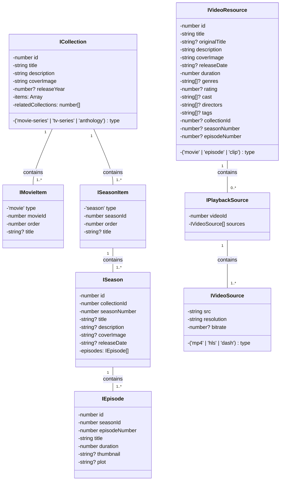

# 视频点播微服务-前端项目

## 待办Todos

* [X]  使用云服务器部署或者 Docker 部署，支持 CI/CD
* [X]  文档完善
* [X]  使用 docker-compose 启动容器
* [X]  页面弹性化，自适应屏幕变化
* [X]  在 Carousel 视频的 videoId 与 列表中的 videoId 不一致，无法准确跳转。
* [X]  删除 vue-tsc --noEmit && vite build --mode production 构建指令
* [X]  阿里云 腾讯云 本地媒体转码服务对比，使用本地转码
* [X]  主键 id 在前端转化成 bigint
* [X]  增加视频资源，支持 HLS 格式播放，使用 xgplayer-hls 插件
* [ ]  支持视频左侧的菜单栏 sidebar：PC 端和 手机端 完成设计吗，模仿腾讯视频，宽设置最小值，不允许无线缩小


## 更新日志
2025-12-31 修复 HLS 视频播放问题，正确配置 xgplayer-hls 插件，支持 HLS 格式视频播放
2025-03-29 模拟资源数据，前端界面展示不报错
2025-02-19 创建 dev 分支，在开发环境启动项目 `npm run dev`
2025-02-17 文档完善，开发环境和生产环境启动项目

## 快速开始

### 项目克隆与依赖安装

```shell
# 克隆项目
git clone https://github.com/xiaolinstar/magic-video-front.git

# 进入项目目录
cd magic-video-front

# 安装依赖
npm install
```

## 项目启动方式

本项目支持三种不同的启动方式，适用于不同的开发和部署场景：

### 方式一：开发环境（Mock 数据模式）

**适用场景：** 前端独立开发、快速原型验证、无需后端服务

**特点：**
- 使用 Mock.js 模拟后端数据
- 支持热重载，开发体验友好
- 无需启动后端服务，可独立运行
- 适合前端功能开发和界面调试

**启动命令：**
```sh
# 方式1：使用 npm 脚本
npm run dev

# 方式2：直接使用 vite 命令
vite --mode development
```

**访问地址：** http://localhost:5173

### 方式二：开发直连环境（后端联调模式）

**适用场景：** 前后端联调、接口测试、完整功能验证

**特点：**
- 直接连接后端 API 服务
- 真实数据交互，完整业务流程
- 需要先启动 magic-video-backend 后端服务
- 适合集成测试和完整功能验证

**前置条件：**
```sh
# 需要先启动后端服务 magic-video-backend
# 确保后端服务运行在配置的端口上
```

**启动命令：**
```sh
# 方式1：使用 npm 脚本
npm run dev:direct

# 方式2：直接使用 vite 命令
vite --mode development.direct
```

**访问地址：** http://localhost:5173

### 方式三：生产环境（容器化部署）

**适用场景：** 生产部署、测试环境、完整服务栈部署

**特点：**
- 基于 Docker 容器化部署
- 使用 Nginx 作为静态资源服务器
- 包含完整的监控和日志系统（Grafana、Loki、Promtail）
- 生产级别的性能和稳定性

**部署步骤：**

1. **构建生产版本**
```sh
npm run build
```

2. **构建 Docker 镜像**
```shell
# 标准构建
docker build -t xxl1997/magic-web-front:0.0.1-SNAPSHOT .

# Windows Docker Desktop 用户使用 buildx
docker buildx build -t xxl1997/magic-web-front:0.0.1-SNAPSHOT .
```

3. **启动完整服务栈**
```shell
# 启动所有服务（包括 Nginx、Grafana、Loki 等）
docker compose up -d

# 查看服务状态
docker compose ps

# 查看服务日志
docker compose logs -f
```

4. **停止服务**
```shell
# 停止并移除所有容器
docker compose down

# 停止并移除所有容器及数据卷
docker compose down -v
```

**服务访问地址：**
- 前端应用：http://localhost:80
- Grafana 监控：http://localhost:3000

**服务架构：**
- `magic-front-nginx`: Nginx 反向代理和静态资源服务
- `magic-web-front`: Vue.js 前端应用容器
- `grafana-front`: Grafana 监控面板
- `loki`: 日志聚合服务
- `promtail`: 日志收集代理

## 环境配置说明

项目使用不同的环境配置文件：
- `.env.development`: 开发环境配置（Mock 模式）
- `.env.development.direct`: 开发直连环境配置
- `.env.production`: 生产环境配置

根据启动方式的不同，Vite 会自动加载对应的环境配置文件。

## 概要设计




## Question

### 前端 Mock 数据

启动 mockjs 后，dashjs 无法播放视频？


## 参考

